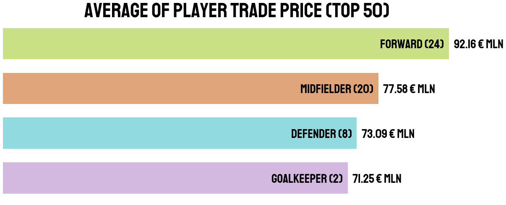

# Expensive Football Players Analysis

## Table of Content
  * [Problem Statement](#problem-statement)
  * [Approach](#approach)
  * [Technologies Used](#technologies-used)
  * [Installation](#installation)
  * [Bugs & Logs](#bugs--logs)
  * [Contributors](#contributors)




## Problem Statement
I will analysis the expensive football player transfers

1. The average of player trade price each position

2. Where club trade the player most?

3. Where is that expensive player's country?

## Approach
Data Exploration : I started exploring dataset using pandas,numpy,matplotlib and seaborn.

Data visualization : Ploted graphs to get insights about dependend and independed variables.

Feature Engineering : Removed missing values and created new features as per insights.

## Technologies Used
 
   1. Python 
   2. Sklearn
   3. Numpy
   4. plotly
   5. Matplotlib
   6. Pandas
   7. Seaborn

## Installation
Click here to install [python](https://www.python.org/downloads/). To install the required packages and libraries, run this pip command in the project directory after cloning the repository:
```bash
git clone https://github.com/hrishikeshkini/Expensive-Football-Players-Analysis.git
pip install -r requirements.txt
```
If pip is not already installed, Follow this [link](https://pip.pypa.io/en/stable/installation/)

## Bugs & Logs

1. If you find a bug, kindly open an issue and it will be addressed as early as possible. [Open](https://github.com/hrishikeshkini/school_donation_analysis/issues)
2. Under localhost, logging is performed for all the actions and its stored onto logs.txt file
3. When the app is deployed on heroku, logs can be viewed on  heroku dashboard or CLI.

## Contributors
  [Hrishikesh Kini](https://github.com/hrishikeshkini)


